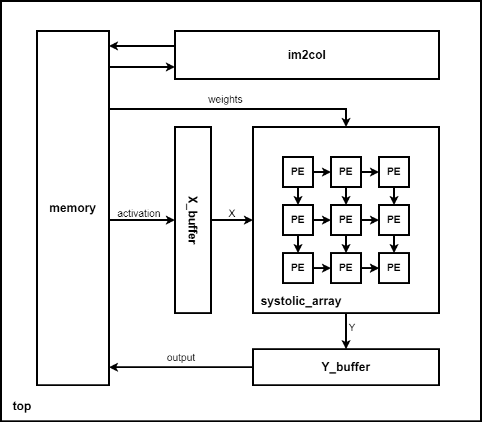
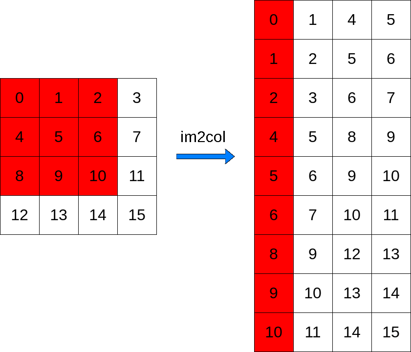
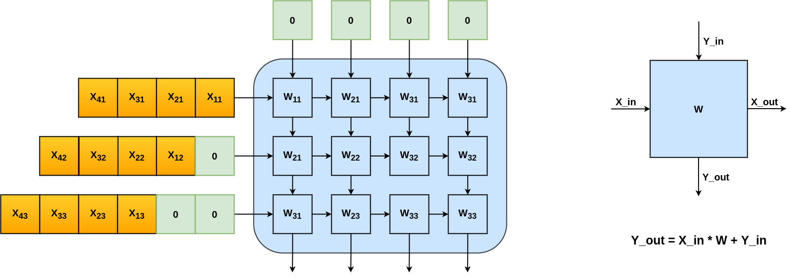
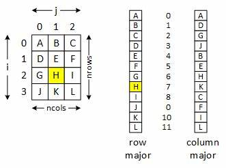
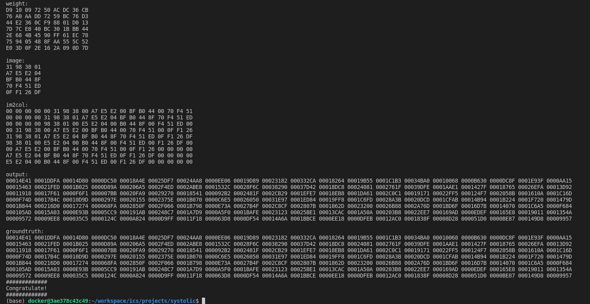

# Lab2: Systolic Array Matrix Multiplication

## Introduction
This lab aims to design a matrix multiplication module based on **systolic array**, and apply it to 2D convolution. The diagram of the system design is shown below.

The inputs of the system is the image and weights (convolution kernels). The **im2col** module is used to do conversion on the image in order to do convolutions using **GEMM**. The **systolic_array** module instantiate a **weight-stationary** systolic array composed by PEs (Processing Elements), it receives the activation **X** from X_buffer and outputs MAC (Multiply Accumulate) results **Y** to Y_buffer.

In this lab, you need to implement the **im2col**, **PE**, and **systolic_array** module by yourself.

<p align="center">
  
</p>
<p align = "center">
  <i>System Top Diagram</i>
</p>

### im2col + GEMM

When performing a 2D convolution, the data in the convolution window is stored discontinously in memory, which is not efficient for computation. The im2col operation is to **expand each convolution window on the image into a column of matrix X**, and **expand each convolution kernel into a row of matrix W**. After im2col, the operation of 2D convolution is equivalent to the mutiplication of matrix X and matrix W. The size of matrix X and matrix W is **M \* N** and **N \* K**, where M is the number of convolution kernels, N is the number of weights in a kernel and K is the number of total image pixels.

<p align="center">
  
</p>
<p align = "center">
  <i>im2col operation  </i>
</p>

### Weight Stationary Systolic Array

The basic component in a systolic is the **Processing Element (PE)**. For a weight stationary systolic array, each PE stores a constant weight **W** and multiply it with input **X_in** then add to **Y_in** on every clock cycle. At the same time, it passes X_in to **X_out** for the neighbor PE. As shown in bellow figure, the input activation is streamed from left side with proper offset. After some delay, the shifted output will be aviliable at the bottom side.

<p align="center">
  
</p>
<p align = "center">
  <i>Weight Stationary Systolic Array</i>
</p>

### Data Storage

All the input and output data are stored on a simulated 32-bit memory, find the start addresses of each parameter in the below form. 
>Important Notice: the image, weights and output matrix are stored in **row-major**, the im2col are stored in **column-major**.

<p align="center">
  
</p>
<p align = "center">
  <i>Row-major & Column-major</i>
</p>

| Name | Value | Description |
| - | - | - |
| IMG_BASE | 0x00000000 | image start address |
| WEIGHT_BASE | 0x00001000 | weights start address |
| IM2COL_BASE | 0x00002000 | im2col start address |
| OUTPUT_BASE | 0x00003000 | output start address |

## Design Specification

You need to implement three modules (im2col, PE, and systolic_array) as described below using **Verilog**.

### Module im2col (im2col.v)

This module performs the im2col conversion. You need to read image values from memory and write them back to the proper location. (Here we only consider 3x3 filters.)

#### Parameters

| name | description |
| - | - |
| IMG_W | image width |
| IMG_H | image height |
| DATA_WIDTH | data width |
| ADDR_WIDTH | address width |
| FILTER_SIZE | size of convolution kernel（e.g. 3 means 3x3 kernel） |
| IMG_BASE | image base address |
| IM2COL_BASE | im2col base address |

#### Ports

| name | type | width | description |
| - | - | - | - |
| clk | input | 1 | clock signal |
| rst | input | 1 | reset signal (active high) |
| data_rd | input | DATA_WIDTH | the value read from memory |
| data_wr | output | DATA_WIDTH | the value write to memory |
| addr_rd | output | ADDR_WIDTH | memory read address |
| addr_wr | output | ADDR_WIDTH | memory write address |
| done | output | 1 | oepration done signal |
| mem_wr_en | output | 1 | memory write enable |

#### Module Behaviour

* Begin im2col conversion when `rst` is pulled down, pull `done` up when finish.
* The memory can be read and write once per clock cycle.
* Use **zero-pedding** in 2D convolution.

### Module PE (pe.v)

The basic function of PE is calculating the dot products of the rows and columns, and streaming the inputs to its neighbors.

#### Parameters

| name | description |
| - | - |
| DATA_WIDTH | data width |

#### Ports

| name | type | width | description |
| - | - | - | - |
| clk | input | 1 | clock signal |
| rst | input | 1 | reset signal (active high) |
| w   | input | DATA_WIDTH | constant weight value |
| x_in | input | DATA_WIDTH | input x |
| y_in | input | DATA_WIDTH | input y |
| x_out | output | DATA_WIDTH | output x |
| y_out | output | DATA_WIDTH | output y |


#### Module Behaviour

* Compute `y_out = x_in*w + y_in` in every clock cycle.
* Streaming out registered version of `x_in` to `x_out`.
* Reset all the outputs to zero on `rst`.

### Module Systolic Array (systolic_array.v)

The systolic array is constructed by instantiate PE modules. You need to connect the PEs properly and do shifts on the input and output.

#### Parameters

| name | description |
| - | - |
| M | number of rows in X (total pixels of the image) |
| N | number of columns in X (number of weights in a convolution kernel) |
| K | number of columns in W (number of convolution kernels) |
| DATA_WIDTH | data width |

#### Ports

| name | type | width | description |
| - | - | - | - |
| clk | input | 1 | clock signal |
| rst | input | 1 | reset signal |
| X | input | DATA_WIDTH\*N | inputs on X side (one row of X) |
| W | input | DATA_WIDTH\*N\*K | weights for all PEs (W\[(i+1)\*DATA_WIDTH-1:i\*DATA_WIDTH\] = memory[WEIGHT_BASE + i])|
| Y | output | DATA_WIDTH*K | outputs on Y side (one row of Y) |
| valid | output | 1 | first output valid signal |
| done | output | 1 | operation done signal |

#### Module Behaviour

* reset all the outputs to zero on `rst`.
* pull `valid` up on the first `Y` is valid.
* pull `done` up when the last `Y` is valid.

## Simulation Environment

### File location
Copy the `lab2` folder to path `~/workspace/ics/projects/` in the docker image. The three module files with ports defination are located in `vsrc/src/`

### Run single test
You may have to install numpy first by `conda install numpy` or `pip3 install numpy`

Simply run `make` under folder `~/workspace/ics/projects/lab2`, it will automatically generate inputs and do a test on your design. If you pass the test, the terminal will show something like

<p align="center">
  
</p>
<p align = "center">
  <i>Successful terminal output</i>
</p>

(numbers are printed in hexadecimal)

#### Specifiy parameters
You can specify the parameters like
```
make IMG_W=5 IMG_H=4 FILTER_NUM=6 FILTER_SIZE=3
```

#### Clean
It is recommended to run `make clean` before every simulation.

### Run multiple tests
Run the scripts
```
bash scripts/run_test.sh
```
It will do multiple tests using parameters read from `test/cases.txt`, you can also add your own cases to it. The result are saved in file `test/result.txt`.

## Grading
### Code (80%)
* Complete im2col (20%)
* Complete systolic array
  * Fail all the tests (0%)
  * Pass N tests (30% + 5% * N)

Your code will be tested by the same testcases in `test/cases.txt`.

### Report (20%)
The report should be written in English and follows the [IEEE double-column template](https://www.ieee.org/conferences/publishing/templates.html). Only PDF format is acceptable.

A good report should includes following components:
* An introduction to briefly introduce the system design.
* Implementation details for each of the modules.
* A strong conclusion to assess and summarize your design.

## Submission
Please compress all the files in your `vsrc/src` folder into a `zip` file with name `{StudentNumber}_EE219_Lab2.zip`, and submit to Blackboard. The file structure should be like
```
2022123123_EE219_Lab2/
|-- report.pdf
|-- src
    |-- im2col.v
    |-- pe.v
    |-- systolic.v
    `-- ...
```

## Reference

[1] Yajun, Ha. EE116: FPGA-based Hardware System Design, ShanghaiTech University, 2020
[2] Siting,Liu EE219: AI Computing Systems, ShanghaiTech University, 2022