# lab-03 The Design of a RISC-V Processor for MAC

## Introduction

The lab aims to design a RISC-V processor supporting MAC (Multiply Accumulate) operation.  The lab introduces a high-custom processor within scalar processor-core, vector processor-core and custom MAC unit. By completing the Verilog codes and designing the corresponding Assembly codes, you will have a deep understanding of the hardware architecture.

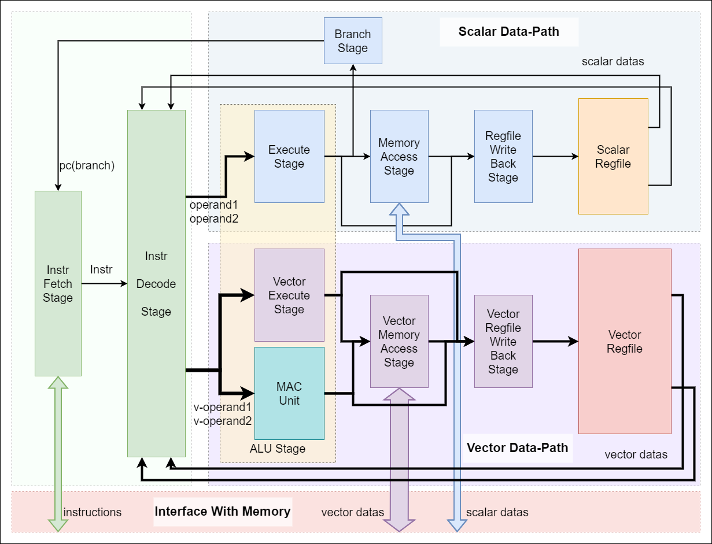

### Vector Processor

In computer architecture, there are two implementation paths for data parallelism: **MIMD (Multiple Instruction Multiple Data)** and  **SIMD (Single Instruction Multiple Data)** . Among the manifestations of MIMD are mainly multi-launch, multi-thread, and multi-core, which can be seen in the contemporary design of processors driven by processing power as the goal. Also, with the rise of applications such as multimedia, big data, and artificial intelligence, it has become increasingly important to endow processors with SIMD processing power. As these applications have a large number of fine-grained, homogeneous, and independent data operations that SIMD is inherently suited to handle. There are three variants of SIMD architecture: vector architecture, SIMD instruction set extensions, and graphics processing units.

The structure of a vector processor fits well with the problem of parallel computation of large amounts of data. A vector processor has multiple ALUs that are capable of performing the same operation many times at the same time. The basic idea of the vector architecture is to collect data elements from memory, put them sequentially into a large set of registers, then operate on them sequentially using a pipelined execution unit, and finally write the result back to memory. **The key feature of vector architecture is a set of vector registers.**

The next picture shows a simplified scalar processor's data flow.

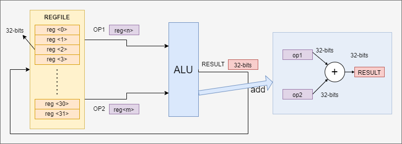

The next picture shows a simplified vector processor's data flow. The scalar operand in scalar architecture is expanded to vector operand in vector architecture. And the relative REGFILE and ALU are expended with vector feature.

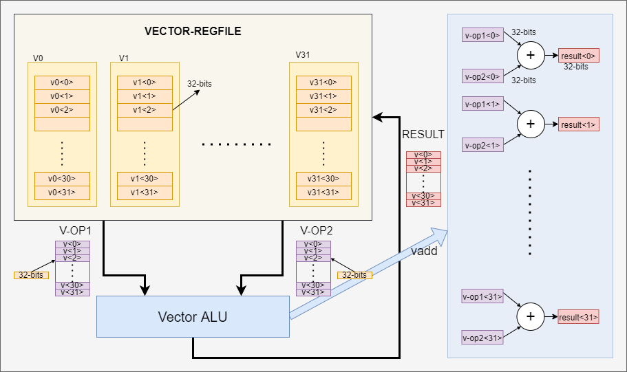

### Case Study

In order to visualize the characteristics of vector processors and conventional processors, we provide one case study. We want to use a vector processor and a conventional processor to perform the following operations separately.


Here X, Y, Z are 8-dimensional vectors, and each element of the vector is one 32-bits integer data; a is a 32-bits integer scalar.

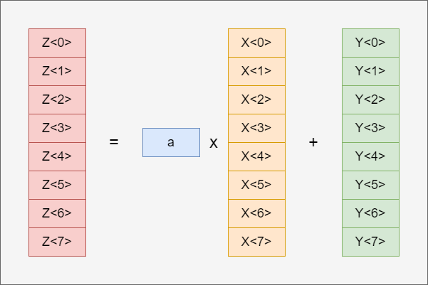

The address of a in memory is in register x4, the base address of X in memory is in register x5, the base address of Y in memory is in register x6, and the base address of Z in memory is in register x7.

| variables                       | a  | X  | Y  | Z  |
| ------------------------------- | -- | -- | -- | -- |
| **base address register** | x4 | x5 | x6 | x7 |

Scalar Processor

The assembly code based on the RISV-V instruction set is shown below.

```
    addi    x1,     $zero,  1       ; set x1 = 1
    lw      x11,    0(x4)           ; load scalar a
    addi    x12,    $zero,  8       ; upper bound of what to load
loop:lw     x13,    0(x5)           ; load X[i]
    mul     x13,    x13,    x11     ; a x X[i]
    lw      x14,    0(x6)           ; load Y[i]
    add     x14,    x14,    x13     ; a x X[i] + Y[i]
    sw      x14,    0(x7)           ; store Z[i]
    addi    x5,     x5,     4       ; increment index to x
    addi    x6,     x6,     4       ; increment index to y
    addi    x7,     x7,     4       ; increment index to z
    sub     x12,    x12,    x1      ; x12 = x12 - 1
    bne     x12,    $zero,  loop    ; check if done
```

#### Vector Processor

The assembly code based on the RISV-V Vector-Extension instruction set is shown below.

```
lw         x11,    0(x4)          ; load scalar a
vle32.v    v13,    0(x5)          ; load vector X
vmul.vx    v14,    v13,    x11    ; a x X
vle32.v    v15,    0(x6)          ; load vector Y
vadd.vv    v16,    v14,    v15    ; Z = a x X + Y
sle32.v    v16,    0(x7)          ; store Z
```

#### Comparison

By comparing the two assembly code implementations, several interesting points are clearly noticeable.

1. The vector processor greatly reduces the bandwidth requirements for dynamic instructions, and the number of instructions in the vector version of the assembly is much smaller than the number of instructions in the scalar version of the assembly code. This is mainly due to the vector processor's ability to directly compute multiple sets of data in parallel, eliminating the need to use circular instructions.
2. The pipeline blocking frequency is much lower in vector processors than in scalar processors. In scalar processors, each loop must be executed sequentially, lw -> mul -> lw -> add -> sw, and each instruction must wait for the previous instruction to finish, which can easily cause pipeline blocking. As for vector processors, pipeline blocking only occurs once per vector operation, and not every time an operation is performed on a vector data element.

### RISC-V

RISC-V is an open instruction set architecture (ISA) based on the principles of Reduced Instruction Set Computing (RISC), with V denoting the fifth generation of RISC (Reduced Instruction Set Computer), which represents the four previous generations of RISC processor prototype chips. Compared to most instruction sets, the RISC-V instruction set is free to be used for any purpose, allowing anyone to design, manufacture and market RISC-V chips and software.

RISC-V instruction set can be subdivided, including RV32I, RV32M, RV32F, RV32D, RV32A, RV32V etc. The instruction set RV32I is the fixed basic integer instruction set, which is also the core content of RISC-V. And the other instruction sets are different extended sets. RV32V is the set with vector extension. Moreover, you can add the custom instruction set following the instruction format. The first stable release of RISC-V's vector extensions, riscv-v-spec-1.0, was released in September 2021.

In this lab, RV32I, RV32V and the custom instruction set are used.

## Lab Tasks

### Tasks

The whole design includes these tasks.

1. Based on the RV-32I instruction set, design a simple processor supporting necessary instructions and program the corresponding assembly code  for matrix MAC operation.
2. Extend the processor with RV-32V Vector Extension instruction set to support vector operation.
3. Insert the custom module MAC_UNIT into the ALU and add the corresponding custom instructions. Meanwhile, program the corresponding assembly code for matrix MAC operation.

### Matrix MAC

The purpose of the designed RISC-V processor is to support the MAC operation. The expected operation is shown below. The dimensions of all matrices are 8 by 8 and each element of the matrices is 32-bits data. Matrix-A is the weight matrix. Matrix-B is the input matrix. Matrix-C is the bias matrix. Matrix-D is the output matrix.

> Assuming no data overflow will occur.

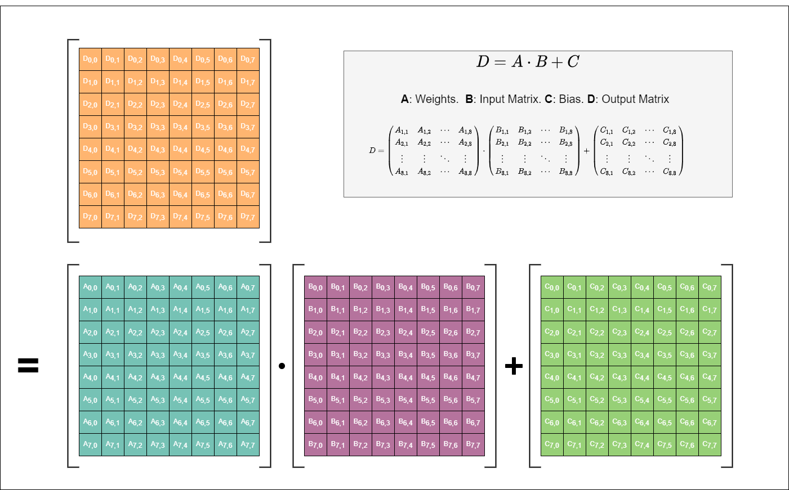

### Memory

The mapping of the data of the matrix to the address of the memory is shown in the figure.

> Note that only matrix-A is mapped row-by-row and other matrices are mapped col-by-col.

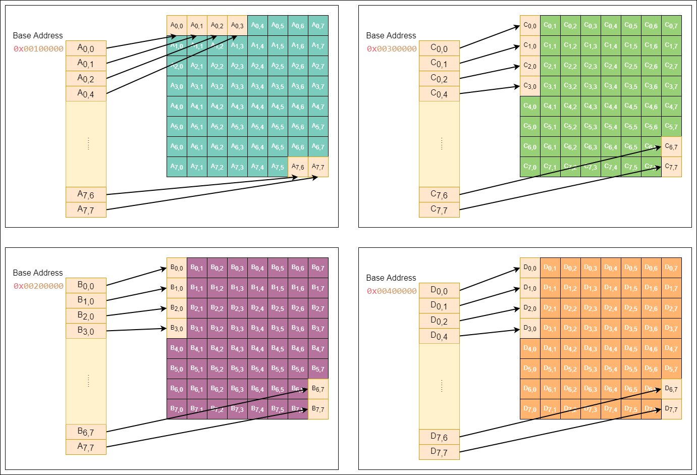

The base address is the first element's address of the data block. The detailed base address information is shown below. To simplify the process of getting the base addresses, the base address data is loaded to the registers when resetting. And it's better not to change the values of these registers.

| **Data** | **Base Address** | **Register** |
| -------------- | ---------------------- | ------------------ |
| Instructions   | 0x80000000             | PC(reset)          |
| Matrix-A       | 0x00100000             | x1                 |
| Matrix-B       | 0x00200000             | x2                 |
| Matrix-C       | 0x00300000             | x3                 |
| Matrix-D       | 0x00400000             | x4                 |

To reduce the challenge of accessing memory, we use 3 simplified memory access models.

> **Caution** : The memory excuse has been greatly simplified here to simplify the difficulty of the experiment. The memory can read out data in one clock cycle (processor clock) during the simulation, but in practice, the memory read and write speed is much lower than the processor's main frequency. In addition, the memory and the processor are often connected through the bus, and instruction storage and data storage do not necessarily use two sets of read-out interfaces, so the processor may also need to arbitrate when reading the memory to decide whether to read the data or the instruction first.

The INST_RAMHelper is used to get the instructions from the memory.

```verilog
module INST_RAMHelper(
  input         clk,
  input         ren,    // read enable 
  input  [31:0] rIdx,   // read address
  output [63:0] rdata   // read data
);
```

The SCALAR_RAMHelper is used to get the scalar data from the memory.

```verilog
module SCALAR_RAMHelper(
  input         clk,
  input         ren,    // read enable 
  input  [31:0] rIdx,   // read address
  output [63:0] rdata,  // read data
  input         wen,    // write enable 
  input  [31:0] wIdx,   // write address
  input  [63:0] wdata,  // write data
  input  [63:0] wmask   // write mask
);
```

The Vector_RAMHelper is used to get the vector data from the memory.

```verilog
module VECTOR_RAMHelper(
  input          clk,
  input          ren,    // read enable 
  input  [31 :0] rIdx,   // read address
  output [255:0] rdata,  // read data
  input          wen,    // write enable 
  input  [31 :0] wIdx,   // write address
  input  [255:0] wdata,  // write data
  input  [255:0] wmask   // write mask
);
```

**Important Notes**

The minimum stride of access memory is 1 Byte (8 bits).

For 64-bits data access, the access address's step is 8. For example, data A and data B are both 64-bit data and stored in adjacent locations. Data A's address is 0x0000_1000 and data B's address is 0x0000_1008.

When the data width of the interface is 64-bits,  it's necessary to split the read data (64-bits) into 2 segments(32-bits) and select the correct segment according to the address, in order to get the 32-bits data. For writing data into memory, the process is similar. The write-data (32-bits) should be embedded in the correct segment (32-bits) of the interface data (64-bits). Meanwhile, the corresponding mask segment should be set high to enable the segment's writing function.

### Assembly Code

The assembly code needs to be translated into machine code by the compiler in order to be recognized and executed by the processor. A simple compiler is provided in the experimental environment to compile the assembly code into a bin file. Using this compiler requires the assembly code to be written in the specified format.

If you are not familiar with the assembly code, you can try to use the RISC-V assembler and runtime simulator.

> [TheThirdOne/rars: RARS -- RISC-V Assembler and Runtime Simulator (github.com)](https://github.com/TheThirdOne/rars)

The file `demo.asm` in the asm folder shows an example code that calls all the used instructions in the lab. Please refer to the format of this code to write assembly code.

The scalar registers' names are `x0-x31`. And `x0` can be replaced with `zero`.

The scalar registers' names are `vx0-vx31`.

```
; =======================================
; scalar instructions
; =======================================
addi    x5,     x1,     0   ; addr_A = A_baseaddr
addi    x6,     x2,     0   ; addr_B = B_baseaddr
addi    x7,     x3,     0   ; addr_C = C_baseaddr
addi    x8,     x4,     0   ; addr_D = D_baseaddr

lw      x9,     0(x5)       ; load scalar data A[0]
lw      x10,    0(x6)       ; load scalar data B[0]
sw      x9,     0(x8)       ; save x9 into mem[x8+0]

add     x11,    x9,     x10 ; x11 = x9 + x10  
mul     x12,    x9,     x10 ; x12 = x9 * x10 

addi    x12,    zero,   0   ; x13 = 0
addi    x12,    x0,     0   ; x13 = 0

addi    x14,    zero,   8   ; x14 = 8
addi    x13,    zero,   0   ; x13 = 0
; for( ; ; x13=x13+1 )
addi    x13,    x13,    1   ; x13 = x13 + 1 
bne     x13,    x14,    -8  ; if(x13 != x14) branch to "addi x13, x13, 1"

; =======================================
; vector instructions
; =======================================
vle32.v vx2,    x5,     1           ; vx2 = mem[addr_A]
vle32.v vx3,    x6,     1           ; vx3 = mem[addr_B]

vmul.vv vx4,    vx2,    vx3,    0   ; vx4 = vx2 * vx3
vadd.vv vx1,    vx1,    vx4,    0   ; vx1 = vx1 + vx4

vse32.v vx1,    x8,     1           ; mem[addr_D] = vx1

; =======================================
; custom instructions
; =======================================
vle32.v vx2,    x5,     1   ; data_A(vx2) = mem[addr_A]
vle32.v vx3,    x6,     1   ; data_B(vx3) = mem[addr_B]
vle32.v vx5,    x7,     1   ; data_C(vx4) = mem[addr_C]

vmac.lw vx5                 ; load coefficient into mac_unit

vmac.en 0,      vx2,    vx3 ; compute the first segment
addi    x5,     x5,     32  ; addr_A = addr_A + 4* 8
vle32.v vx2,    x5,     1   ;   data_A = mem[addr_A]
vmac.en 1,      vx2,    vx3 ; compute the second segment
addi    x5,     x5,     32  ; addr_A = addr_A + 4* 8
vle32.v vx2,    x5,     1   ;   data_A = mem[addr_A]
vmac.en 2,      vx2,    vx3 ; compute the third segment

vmac.sw vx1                 ; export the result in mac_unit into vx1 
```

## Design Specification

This lab provides a framework for a customized RISCV processor including a scalar core, a vector core and a MAC unit.

```
`-- vsrc
    |-- top.v
    |-- common
    |   |-- defines.v
    |   |-- alu_stage.v
    |   |-- id_stage.v		task-1 task-2
    |   `-- rvcpu.v
    |-- mac
    |   `-- mac_unit.v		task-3
    |-- scalar
    |   |-- branch_stage.v
    |   |-- exe_stage.v		task-1
    |   |-- if_stage.v
    |   |-- mem_stage.v		task-1
    |   |-- regfile.v
    |   `-- wb_stage.v
    `-- vector
        |-- vexe_stage.v	task-2
        |-- vmem_stage.v
        |-- vregfile.v		task-2
        `-- vwb_stage.v
```

### Task1 - RV-32I Processor

#### Detailed Requirements

1. The provided framework already supports several instructions, including `lw`,`addi`,`add`,`bne` . To support MAC, extra instructions should be added to the processor. You need to modify the modules `vsrc/common/id_stage.v`,   `vsrc/scalar/exe_stage.v`, `vsrc/scalar/mem_stage.v` to support these instructions, `mul`,`sw`.
2. After adding the instructions, program an assembly code to do the matrix MAC operation (D=AB+C) and save the result (D) into memory.

#### Instructions

##### ADDI


```
addi rd, rs1, imm
; x[rd] = x[rs1] + sext(imm)
; sext means signed extension and usually imm is signend extended to 32-bits
```

##### ADD


```
add rd, rs1, rs2
; x[rd] = x[rs1] + x[rs2]
```

##### MUL


```
mul rd, rs1, rs2
; x[rd] = ( x[rs1] * x[rs2] )[31:0]
```

##### LW


```
lw rd, offset(rs1)
; x[rd] = Memory[ x[rs1] + sext(offset) ]
```

##### SW


```
sw rs2, offset(rs1)
; Memory[ x[rs1] + sext(offset) ] = x[rs2]
```

##### BNE


```
bne rs1, rs2, offset
; if (rs1 != rs2) pc += sext(offset)
```

### Task2 - Vector Extension

#### Detailed Requirements

1. Complete the modules, `vsrc/vector/vregfile.v`,`vsrc/vector/vexe_stage.v` and `vsrc/common/id_stage.v` to support `vadd.vv`,`vmul.vv`,`vle32.v` and `vse32.v`.
2. **(optional bonus)** Consider whether the matrix MAC operation can be done with only these vector instructions ( `vadd.vv`,`vmul.vv`,`vle32.v` and `vse32.v` ). If not, give the reason in the report. If the available instructions are extended with the accomplished scalar instructions, program the assembly code to do the matrix MAC operation and compare the code with task1 in the report.

#### General Setting

##### Vector Data Width Setting

The vector extended RISCV processor contains 32 vector registers, `x0-x31`.

`VLEN`: represents a fixed bit width for each vector register.

`SEW`: represents the bit width of the selected vector element. It is controlled by register vsew[2:0].

Taking `VLEN=128bits` as an example, the correspondence between the number of elements contained in each vector register and `SEW` is shown in the following table.

| **VELN** | **SEW** | **Elements Per Vector Register** |
| :------------: | :-----------: | :------------------------------------: |
|      128      |      64      |                   2                   |
|      128      |      32      |                   4                   |
|      128      |      16      |                   8                   |
|      128      |       8       |                   16                   |

`LMUL`: represents the vector length multiplier. When greater than 1, it represents the default number of vector registers. Multiple vector registers can be grouped, so a vector instruction can operate on multiple vector registers.

`VLMAX`: represents the maximum number of vector elements that a vector instruction can operate on. `VLMAX=LMUL*VLEN/SEW`.

**To simplify the experiment, we set all the above parameters to fixed values.**


##### Mask Setting

In the arithmetic and access instructions, you can choose whether to use the mask mask or not, and whether to enable the function is controlled by the vm bit in the instruction.

In this experiment, the mask is not used by default. **And **`vm`** is set to 1 in all instructions to disable the mask function.**

##### Load/Store Setting

There are 3 different access modes for RISC-V vector extensions:  **unit-stride, stided, indexed** .

The `unit-stride` operation accesses consecutive elements stored in memory starting at the base effective address.

The `strided` operation accesses the first memory element at the base effective address, and then accesses subsequent elements at the address increment given by the byte offset contained in the x register specified by rs2.

The `indexed` operation adds the vector offset specified by rs2 to the base effective address to obtain the effective address of each element.

The following images describe the format of the access command and its specific meaning.

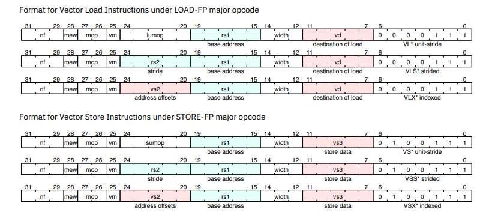


In order to simplify the experiment, this experiment **only needs to support the access mode of **`unit-stride`**. In addition, the **`nf`**, **`mew`**, **`mop`**, and **`lumop`** bits of the access instruction can be set to the default value of 0.**

#### Instructions

##### VADD.VV


```
; vector-vector addition
vadd.vv vd, vs2, vs1, vm ; default vm = 1 (disable mask)
; vd[n] = vs2[n] + vs1[n]
```

##### VMUL.VV


```
; vector-vector signed multiply
; return low bits of product 
vmul.vv vd, vs2, vs1, vm ; default vm = 1 (disable mask)
; vd[n] = (vs2[n] * vs1[n])[31:0]
```

##### VLE32.V


```
; 32-bit unit-stride load
; load the data (width: VLEN) from memory into the vector register
vle32.v   vd, rs1, vm  ; default vm = 1 (disable mask)
; vd = mem[rs1]
```

##### VSE32.V


```
; 32-bit unit-stride store
; save the data (width: VLEN) from vector register into the memory
vse32.v   vs3, rs1, vm  ; default vm = 1 (disable mask)
; mem[rs1] = vs3
```

### Task3 - Custom Extension

#### Detailed Requirements

1. Complete the module `vsrc/mac/mac_unit.v`. (The instructions have been accomplished.)
2. Program the assembly code to use the mac_unit to finish the matrix MAC.

#### MAC UNIT

The multiply-accumulate operation can be performed using the provided multiply-accumulate module. The diagram of this module is shown in the following figure.

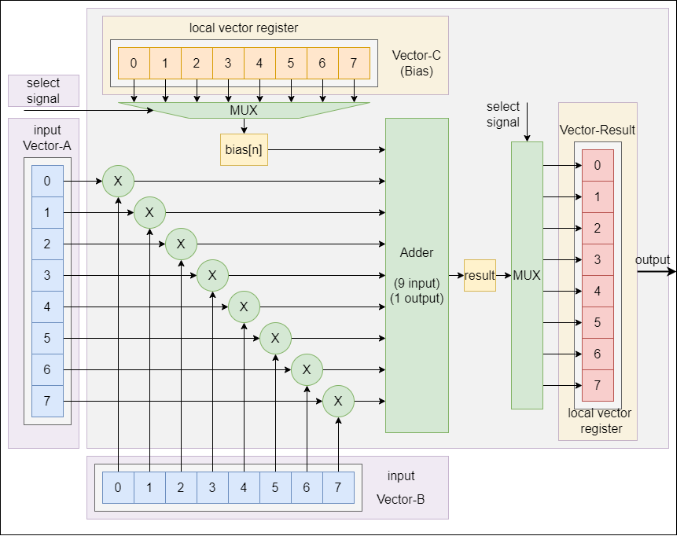

The module's interface is shown below.

```verilog
module mac_unit(
    input               clk,
    input               rst,
    input [`ALU_OP_BUS] alu_opcode_i,
    input [2 : 0]       mac_sel_i,

    input [`VREG_BUS]   mac_op_v1_i,
    input [`VREG_BUS]   mac_op_v2_i,
    output [`VREG_BUS]  mac_result_o
);
```

Instructions
VMAC.LW

#### Instructions

##### VMAC.LW


```
; load vector register vs1' data into mac_unit's internal bias vector register
; vs1 is the bias vector ( stored in matrix-C )
vmac.lw vs1
; biasn[n] = vs1[n]
```

##### VMAC.SW


```
; save the mac_unit's result vector register's data into the vectore register vd
; result is the internal result vector register
vmac.sw vd
; vd[n] = result[n]
```

##### VMAC.EN


```
; do the MAC operation
; result[sel] = vs2[0]*vs1[0] + vs2[1]*vs1[1] + ... + vs2[7]*vs1[7] + bias[sel]
; result is the internal result vector register
; bias is the internal bias vector register
vmac.en sel, vs2, vs1
; example
vmac.en 0, vx10, vx11
vmac.en 1, vx10, vx11
;......
vmac.en 7, vx10, vx11
```

To do the matrix MAC, you need to encode vmac.en 's sel from 0 to 7 several times.

| **sel** | **Coefficient** | **operation** |
| ------------- | --------------------- | ------------------- |
| 3'b000        | C[0]                  | D[0] = AxB + C[0]   |
| 3'b001        | C[1]                  | D[1] = AxB + C[1]   |
| 3'b010        | C[2]                  | D[2] = AxB + C[2]   |
| 3'b011        | C[3]                  | D[3] = AxB + C[3]   |
| 3'b100        | C[4]                  | D[3] = AxB + C[4]   |
| 3'b101        | C[5]                  | D[3] = AxB + C[5]   |
| 3'b110        | C[6]                  | D[3] = AxB + C[6]   |
| 3'b111        | C[7]                  | D[3] = AxB + C[7]   |

## Simulation

### File Tree

You should modify the verilog in `vsrc` folder and modify the assembly code in `asm` folder.

```Plain%20Text
.
|-- Makefile  
|-- asm           --*Folder containing the assembly codes
|-- bin           --Folder containing the bin file used in simulation
|-- build_test    --Folder containing the simulation files
|-- csrc          --Folder containing the cpp files
|-- data          --Folder containing the test case data
|-- tools         --Folder containing the python codes
`-- vsrc          --*Folder containing the verilog codes
```

### Make Command

Run the simulation and test. `IMG_NAME` is your assembly code name. You can modify the parameter `IMG_NAME` in `Makefile` or in command.

```Plain%20Text
make run IMG_NAME=demo
```

If your computation result is correct, there will be a message showing `Pass` in the bash.

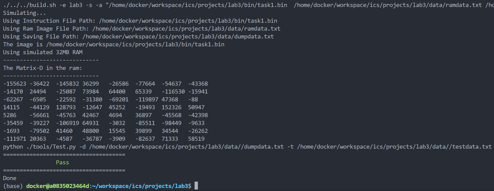

If your computation result is wrong, there will be a message showing Fail in the bash. And the comparison information will be displayed.

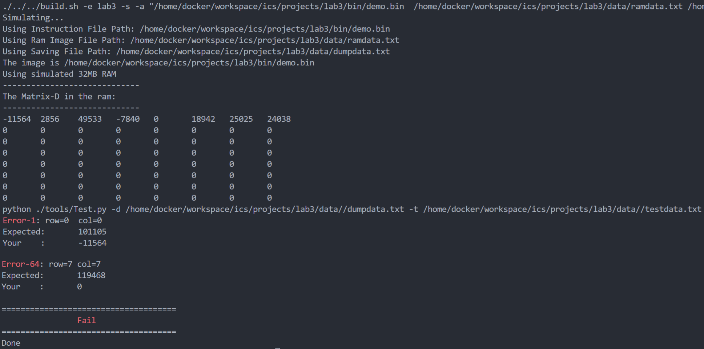

### Debug

You can check and compare the `dumpdata.txt` and `testdata.txt` in conjunction with `ramdata.txt` .

File `ramdata.txt` stores matrices A, B.T and C.T .

File `testdata.txt` stores the correct result, matrix D.T as the reference.

File `dumpdata.txt` stores the dumped result, matrix D.T to be compared with `testdata.txt` .

The next picture shows the content of `ramdata.txt` containing the matrices A, B.T and C.T .

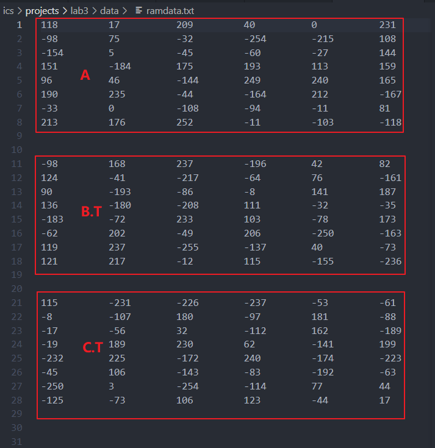

You can also modify the `csrc/main.cpp` to show the matrices in bash. Just cancel the comments of the code show_ram() .

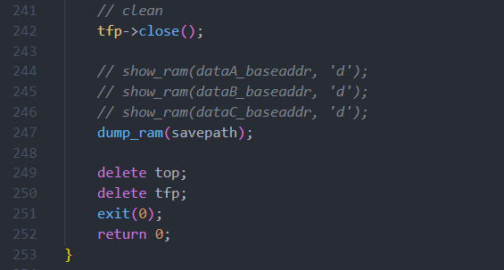

## Marking

The total score (100%) is the sum of code (80%) and report writing (20%).

### Code (80%)

* Successful submission (5%)
* Complete the task-1 (25%)
  * Complete the HDL-code (5%)
  * Complete the assembly code (10%)
  * Pass the MAC test (10%)
* Complete the task-2 (20%)
  * Complete the HDL-code (20%)
  * Complete the assembly code and pass the MAC test (optional 5%)
* Complete the task-3 (30%)
  * Complete the HDL-code of MAC unit (10%)
  * Complete the assembly code (10%)
  * Pass the MAC test (10%)

### Report (20%)

The report should be written in English and follows the [IEEE double-column template](https://www.ieee.org/conferences/publishing/templates.html). Only PDF format is acceptable.

The report should include the following components:

* The design idea and implementation details of each task's Verilog code.
* The design idea and implementation details of each assembly code.
* The screenshots of passing the test case.
* An introduction to briefly introduce and compare the 3 kinds of architecture.
  * The comparison should cover software and hardware designs.
* The conclusion of the lab and your suggestion about the lab.

## Bonus

1. Finish the optional content of task2.
2. Try to optimize the single-cycle processor to five-stage flow processors.

## Submission

Using the make command to export the git log file and pack up tha lab3 folder. You will get the compressed file `lab3.tar.gz` in `ICS/projects`.

```
make pack
```

Please compress `lab3.tar.gz` and the report into a `zip` file with name `{StudentNumber}_EE219_Lab3.zip`, and submit to Blackboard. The file structure should be like this.

```
12345678_EE219_Lab3.zip
|-- report.pdf
|-- lab3.tar.gz
```

## Reference Link

[RISC-V手册 (riscvbook.com)](http://riscvbook.com/chinese/RISC-V-Reader-Chinese-v2p1.pdf)

[riscv-spec-20191213.pdf](https://riscv.org/wp-content/uploads/2019/12/riscv-spec-20191213.pdf)

[riscv-card/riscv-card.pdf at master · jameslzhu/riscv-card (github.com)](https://github.com/jameslzhu/riscv-card/blob/master/riscv-card.pdf)

[计算机与智能处理器体系结构 AI-Core and RISC Architecture (cihlab.top)](https://arch.cihlab.top/ca2020_L07.pdf)

[复旦大学陈迟晓《计算机与智能处理器体系结构 AI-Core and RISC Architecture》Spring 2020_哔哩哔哩_bilibili](https://www.bilibili.com/video/BV1ff4y1X7kP?p=16)
