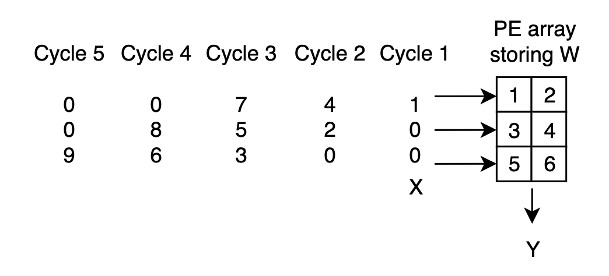

**Systolic Array Example Introduced in the Lecture Slides**
 
There are three verilog file: `PE.v` is a single MAC unit with control signals; `PE_array.v` is a 2D systolic array consisting of the MAC units; `PE_array_tb.v` is a testbench for `PE_array.v`, computing 

<p align="center">
  
</p>
<p align = "center">
</p>

To run the testbench, use the command line either in the experiment environment or on your local computer (with iverilog installed), `cd` to the folder containing the verilog code and type in the following commands
```
iverilog -o PE_array_test PE_array_tb.v PE_array.v PE.v
vvp PE_array_test
```
After this, the simulation results are printed, but they are in hexadecimal, so do not reveal the real values, especially the output results are concatenated as one `reg` signal. To verify the results, the waveform file is also generated as `PE_array_tb.vcd`. View it using either **WaveTrace** or **gtkwave**.

The signal `W` represents the weights and they are concatenated as one signal (010203040506)<sub>16</sub>; the input signals are re-arranged as shown in the below figure

<p align="center">
  
</p>
<p align = "center">
  <i>Systolic Array</i>
</p>

So the input signal `X` are (010000)<sub>16</sub>, (040200)<sub>16</sub>, (070503)<sub>16</sub>, (000806)<sub>16</sub>, (000009)<sub>16</sub> repectively for each clock cycle. The output result should be 

<p align="center">
  
</p>
<p align = "center">
</p>

## Reference

[1] Yajun, Ha. EE116: FPGA-based Hardware System Design. ShanghaiTech University, 2020
